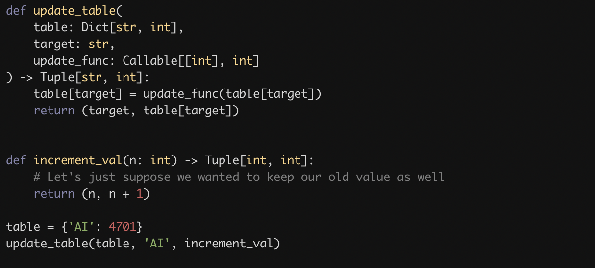
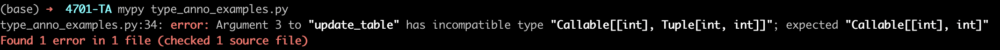
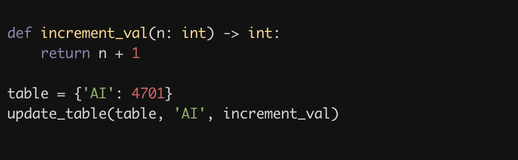
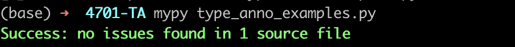

# Python Programming Guidelines

We’ve distilled below the programming practices that we learned were useful for students in past semesters! As made clear in the course prerequisites, we expect that you are at least somewhat familiar with python programming. That said, these guidelines will mostly outline good practices to follow when doing the programming homeworks (and in general). 

While the points made in the guidelines are not strictly mandatory for your homework submissions (except for the **bolded** parts), you are strongly encouraged to adopt these practices because:

- They will make the debugging process for *you* easier.
- If you reach out to the TA’s for programming questions, we’ll be able to understand your code more quickly.
- They are good programming practices in general.

So, please read this article thoroughly!

### 1. Type Annotations

A common source of error when programming in Python is using the wrong types. For instance, 

```python
"""Example 1"""
#   An instance of 'node' is of type Dict with keys (str, node, int)
node = {'state':start, 'parent': some_node, 'cost':0} 
#   Our dict 'reached' takes key: str and value: 'node'
reached = {start: node}

#   Later in the best first search code....
reached[some_str] = node['state'] # Incorrect! Dict value should be 'node'.

"""Example 2"""
def cost_fn(node, goal):    # expects type 'node' and 'str' as inputs
	heuristic = sum([ord(x) - ord(y) for x, y in zip(node['state'], goal)])
  return node['cost'] + heuristic.   # outputs type 'int'

cost = cost_fn(node['state'], goal) # Incorrect! A 'str' is incorrectly fed.
```

How can we avoid this kind of confusion? Python lets us annotate variables with their expected types.

For instance, we can improve and correct the above code like this:

```python
class Node(TypedDict): 
		state: str
		parent: Optional['Node']  
		cost: int

# or better...
@dataclass
class Node:
	state: str
	parent: Optional['Node']
	cost: int

# Type annotated variables:
node: Node = Node({state: start, parent: None, cost: 0})
reached: Dict[str, Node] = {start: node}

# Type annotated function:
def cost_fn(node: Node, goal: str) -> int:
	heuristic = sum([ord(x) - ord(y) for x, y in zip(node['state'], goal)])
  return node['cost'] + heuristic.   # outputs type 'int'
```

In particular, we have annotated that the object `Node` is a `dict` with fields of type `str, Optional[Node], int`, or the function `cost_fn` to take inputs of type `Node` and `str`, and spit out in `int`. 

Why do we want to do this? Besides preventing type errors earlier, getting into the habit of annotating types will help writing complex problems more easily. In particular, it will help clear out questions like “how should I structure a variable before passing it to another function?” or “does it make sense to use call this function here? If not, how should I fix it?” more easily. You will know exactly what variable you should be passing into any function. 

To break this down a bit more, here are the primitive types in Python, as well as some commonly used compound types:

```python
""" Some common annotations """
from typing import Callable, Dict, List, Tuple, Union
import numpy.typing as npt

# primitive types:
int, str, float, bool

# nonprimitive types
List[int]             # List of ints
Union[int, str]       # Either int or str
List[Union[int, str]] # List of (int or str); [0, "abc", 1]
Dict[str, int]        # Dict of 'str' key and 'int' value; {"AI": 4701}
Tuple[str, int]       # A tuple (str, int); ("70 Morningside Drv", 10027)
Callable[[int, int], int] # A function f: int, int -> int

# numpy types
x: np.NDArray         # x is a numpy array
```

You can familiarize yourself with type annotations with more examples below. There are also plenty of good resources online that you may find by searching on Google.

```python
from typing import List, Dict, Tuple, Callable

def say_hello(name: str) -> None:
    print(f"Hello, {name}!")

def list_sum(lst: List[int]) -> int:
    lsum = 0
    for itm in lst:
        lsum = lsum + itm
    return lsum

def fibonacci(n: int) -> int:
    if n <= 1:
        return 0
    return fibonacci(n-1) + fibonacci(n-2)

def update_table(
    table: Dict[str, int],
    target: str,
    update_func: Callable[[int], int]
) -> Tuple[str, int]:
    table[target] = update_func(table[target])
    return (target, table[target])
```

While Python doesn’t natively perform any static type-checking (i.e. it won’t catch type-related bugs before your code executes, like `C` or `Java` might do), it does have an official tool via `mypy` to run type-checking. To use this feature, you can do the following:

```python
$ pip install mypy
$ mypy type_anno_example.py
```

Below is a simple example illustrating what this tool looks like:

**Buggy Code:**



`mypy` output:



**Buggy code resolved:**



`mypy` output:



### 2. A Potpourri of Practices for Code Clarity

*Adapted and Taken from [clean-code-python](https://github.com/zedr/clean-code-python). The code examples are taken directly from the article.* 

The link above contains an extensive list of good practices and clean code conventions **specifically** for Python. It is an extremely helpful resource to have it baked into your habits, but we’ve listed out a minimal set of guidelines we care most about. 

1. Try to keep lines under 80 characters long. The number “80” is the most popular opinion among programmers, but we understand that it is up to debate. For instance, a code formatting tool we will introduce (called `black`) defaults to 88 characters per line. The bottom line is to keep them short enough so that your lines won’t have to wrap around when you don’t have your editor on full-screen.

2. Use just the right amount of line breaks and whitespaces; don’t underuse, don’t overuse. For instance, it would be neater to separate blocks of related logic with line breaks. 

3. Tabs? Spaces? We don’t mind, but stick to one. Python happens to be sensitive to whitespace and indentation, so mixing both can give you `Indentation Error`s. If you do spaces, 4 spaces per indentation seem to be the norm for Python.

4. Use expressive and pronounceable variable and function names. For example,

```python
import datetime

# Bad
ymdstr = datetime.date.today().strftime("%y-%m-%d")

# Good
current_date: str = datetime.date.today().strftime("%y-%m-%d")
```

```python
# Bad:
seq = ("Austin", "New York", "San Francisco")

for item in seq:
    #do_stuff()
    #do_some_other_stuff()

    # Wait, what's `item` again?
    print(item)

# Good:
locations = ("Austin", "New York", "San Francisco")

for location in locations:
    # do_stuff()
    # do_some_other_stuff()
    # ...
    print(location)
```

5. Functions should do one thing, and should only be one level of abstraction. Taken from the *clean-code-python* post:

> This is by far the most important rule in software engineering. When functions do more than one thing, they are harder to compose, test, and reason about. When you can isolate a function to just one action, they can be refactored easily and your code will read much cleaner. If you take nothing else away from this guide other than this, you'll be ahead of many developers.
 

To illustrate what this means:

```python
"""Example 1"""

# Bad:
from typing import List

class Client:
    active: bool

def email(client: Client) -> None:
    # Implementation omitted
    pass

def email_clients(clients: List[Client]) -> None:
    """Filter active clients and send them an email.
    """
    for client in clients:
        if client.active:
            email(client)

# Better:
def email(client: Client) -> None:
    # Implementation omitted
    pass

def get_active_clients(clients: List[Client]) -> List[Client]:
    """Filter active clients.
    """
    return [client for client in clients if client.active]

def email_clients(clients: List[Client]) -> None:
    """Send an email to a given list of clients.
    """
    for client in get_active_clients(clients):
        email(client)
```

```python
"""Example 2"""
# Good
def parse_better_js_alternative(code: str) -> None:
    regexes = [
        # ...
    ]

    statements = code.split('\n')
    tokens = []
    for regex in regexes:
        for statement in statements:
            # Implementation omitted
            pass

    ast = []
    for token in tokens:
        # Implementation omitted
        pass

    for node in ast:
        # Implementation omitted
        pass

# Good
from typing import Tuple, List, Dict

REGEXES: Tuple = (
   # ...
)

def parse_better_js_alternative(code: str) -> None:
    tokens: List = tokenize(code)
    syntax_tree: List = parse(tokens)

    for node in syntax_tree:
        # Implementation omitted
        pass

def tokenize(code: str) -> List:
    statements = code.split()
    tokens: List[Dict] = []
    for regex in REGEXES:
        for statement in statements:
            # Implementation omitted
            pass

    return tokens

def parse(tokens: List) -> List:
    syntax_tree: List[Dict] = []
    for token in tokens:
        # Implementation omitted
        pass

    return syntax_tree
```

6. Avoid *side effects*. We say that a function produces a side effects if it changes the state of an object outside the scope of the function. This isn’t great because functions with side effect can lead to hard-to-detect and surprising errors. In other words, they can make the behavior of your code unpredictable. For instance, 

```python
# This is a module-level name.
# It's good practice to define these as immutable values, such as a string.
# However...
fullname = "Ryan McDermott"

def split_into_first_and_last_name() -> None:
    # The use of the global keyword here is changing the meaning of the
    # the following line. This function is now mutating the module-level
    # state and introducing a side-effect!
    global fullname
    fullname = fullname.split()

split_into_first_and_last_name()

# MyPy will spot the problem, complaining about 'Incompatible types in
# assignment: (expression has type "List[str]", variable has type "str")'
print(fullname)  # ["Ryan", "McDermott"]

# OK. It worked the first time, but what will happen if we call the
# function again?
```

Instead, we could do this:

```python
def split_into_first_and_last_name(name: AnyStr) -> List[AnyStr]:
    return name.split()

fullname = "Ryan McDermott"
name, surname = split_into_first_and_last_name(fullname)

print(name, surname)  # => Ryan McDermott
```

Since you would likely write object-oriented code in Python, there will be cases where your function must produce a side effect. If so, keep track of the mutations that happens to the states, as it can be the source of errors.

In general, **never** use python’s `global` variables. [Here](https://stackoverflow.com/a/19158418) is a great stackoverflow post explaining why it is considered bad practice. **They also will not work with our autograder scripts, and we unfortunately won’t be able to accomodate re-run requests for using global variables.** 

**A Handy Tool for Code Formatting: `black`** 

`[black](https://github.com/psf/black)` is a widely-used python formatter that should handle points 1~3 above for you. After you install it with

```shell
$ pip install black
```

and provide the path to your python file as a command line input:

```shell
$ black [path to your python file].py
```

Feel free to try this out and see how this formates your code! 

### 3. Using External Libraries

Our homework programming questions will depend on some python packages, like `numpy` and `matplotlib`. We will be transparent with which packages (and their versions) our solution code is based on, and which versions will be compatible with our autograder script. **That said, we cannot accomodate errors caused by**

- **version discrepancy (e.g. the numpy function `some_numpy_fn()` exists in numpy version `1.X` but not in `>= 2.X`, which we will support)**
- **Using packages not specified to be supported (e.g. `scipy`, if we specifically say our autograder server will only have `numpy` installed). When in doubt, please ask in Edstem!**

It has been specified in the course requirements that students are comfortable with python programming. **We will assume that this entails being able to figure out how to use unfamiliar packages by reading documentation, stackoverflow posts, blog articles, etc.** Again, the TA’s will generally not be available to answer debugging questions that arise from not having read these resources beforehand. 

That’s about it! Thanks for reading this.
